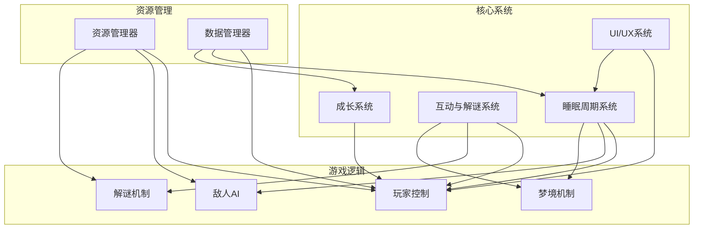
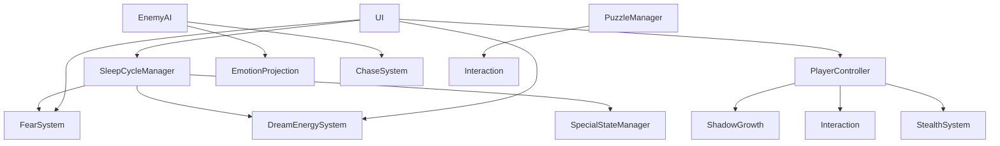

# 《影梦》(Silhouette Dream) 代码 Wiki 文档

## 1. 项目概述

### 1.1 项目简介

《影梦》是一款剧情向横版解谜冒险游戏，玩家扮演小男孩的影子，在梦境与现实之间穿梭，通过解谜、探索与轻度紧张互动体验剧情与情感。

- **游戏类型**：横版剧情向解谜冒险游戏
- **引擎**：Godot 4.x
- **美术风格**：伪3D俯视角像素风，千禧年梦核风
- **核心主题**：内心成长与自我和解，通过梦境冒险反映现实心理蜕变

### 1.2 开发状态

- **当前阶段**：概念设计阶段
- **主要瓶颈**：核心玩法机制尚未最终确定
- **技术选型**：Godot 4.x引擎，PC/主机平台，目标60FPS稳定运行

## 2. 项目架构

### 2.1 目录结构

```
GAME_MAKING/
├── Assets/            # 游戏资源
│   ├── Sprites/       # 角色、敌人、环境精灵图
│   └── Audio/         # 背景音乐、音效
├── Scripts/           # 游戏脚本
│   ├── Player/        # 玩家控制、状态、动画
│   ├── Enemies/       # 敌人AI、行为树
│   ├── Puzzles/       # 解谜机关、互动系统
│   └── Systems/       # 核心系统脚本
├── Scenes/            # Godot场景文件
│   ├── Characters/    # 角色场景
│   ├── Rooms/         # 房间场景
│   └── UI/            # 界面场景
├── docs/              # 项目文档
├── openspec/          # 变更管理
└── agents/            # Agent文档
```

### 2.2 核心系统架构



## 3. 主要模块职责

### 3.1 睡眠周期系统

| 模块 | 职责 | 文件位置 | 核心功能 |
|------|------|---------|----------|
| 睡眠阶段管理器 | 管理睡眠周期的切换和状态 | Scripts/Systems/SleepCycleManager.gd | 控制清醒期、浅睡期、深睡期、REM期的切换和持续时间 |
| 恐惧系统 | 管理玩家的恐惧值和状态 | Scripts/Systems/FearSystem.gd | 计算和更新恐惧值，触发不同的恐慌状态 |
| 梦境能量系统 | 管理REM期和清醒梦的能量 | Scripts/Systems/DreamEnergySystem.gd | 计算和更新梦境能量，控制技能使用 |
| 特殊状态管理器 | 处理梦中梦、清醒梦、鬼压床 | Scripts/Systems/SpecialStateManager.gd | 管理特殊睡眠状态的触发和效果 |

### 3.2 互动与解谜系统

| 模块 | 职责 | 文件位置 | 核心功能 |
|------|------|---------|----------|
| 基础互动 | 处理玩家与环境的基本互动 | Scripts/Player/Interaction.gd | 实现开关、推箱子、捡取物品等基础互动 |
| 潜行系统 | 处理玩家的潜行和躲避 | Scripts/Player/StealthSystem.gd | 实现掩体系统、视线检测、声音吸引 |
| 追逐系统 | 处理敌人的追逐和玩家的逃脱 | Scripts/Systems/ChaseSystem.gd | 实现敌人追踪、警报状态、逃脱判定 |
| 解谜管理器 | 管理各种谜题的逻辑 | Scripts/Puzzles/PuzzleManager.gd | 实现环境解谜、记忆解谜、时序解谜等 |

### 3.3 成长系统

| 模块 | 职责 | 文件位置 | 核心功能 |
|------|------|---------|----------|
| 影子成长 | 管理影子的属性和技能 | Scripts/Player/ShadowGrowth.gd | 实现属性成长、技能树、天赋系统 |
| 小男孩成长 | 管理现实世界的成长 | Scripts/Systems/BoyGrowth.gd | 实现现实世界的成长系统与影子的联动 |
| 解锁系统 | 管理新内容的解锁 | Scripts/Systems/UnlockSystem.gd | 实现新区域、新技能、新剧情的解锁条件 |

### 3.4 敌人系统

| 模块 | 职责 | 文件位置 | 核心功能 |
|------|------|---------|----------|
| 敌人AI | 实现敌人的行为逻辑 | Scripts/Enemies/EnemyAI.gd | 实现巡逻、追踪、潜伏等行为模式 |
| 敌人管理器 | 管理敌人的生成和行为 | Scripts/Enemies/EnemyManager.gd | 控制敌人的生成、刷新和状态管理 |
| 情绪投射 | 实现敌人与情绪的关联 | Scripts/Enemies/EmotionProjection.gd | 将负面情绪转化为敌人行为和属性 |

### 3.5 UI/UX系统

| 模块 | 职责 | 文件位置 | 核心功能 |
|------|------|---------|----------|
| 睡眠阶段UI | 显示睡眠阶段信息 | Scenes/UI/SleepPhaseUI.tscn | 显示当前睡眠阶段、恐惧值、梦境能量 |
| 特殊状态UI | 显示特殊状态信息 | Scenes/UI/SpecialStateUI.tscn | 显示梦中梦、鬼压床等特殊状态 |
| 菜单系统 | 实现游戏菜单功能 | Scenes/UI/MainMenu.tscn | 实现主菜单、暂停菜单、设置菜单 |

## 4. 关键类与函数

### 4.1 睡眠周期系统

#### SleepCycleManager 类

| 函数名 | 参数 | 返回值 | 描述 |
|--------|------|--------|------|
| `initialize_cycle()` | 无 | void | 初始化睡眠周期 |
| `update_phase()` | delta: float | void | 更新当前睡眠阶段 |
| `switch_phase(new_phase: String)` | new_phase: String | void | 切换到新的睡眠阶段 |
| `get_current_phase()` | 无 | String | 获取当前睡眠阶段 |
| `get_phase_duration()` | phase: String | float | 获取指定阶段的持续时间 |

#### FearSystem 类

| 函数名 | 参数 | 返回值 | 描述 |
|--------|------|--------|------|
| `update_fear(delta: float)` | delta: float | void | 更新恐惧值 |
| `add_fear(amount: float)` | amount: float | void | 增加恐惧值 |
| `reduce_fear(amount: float)` | amount: float | void | 减少恐惧值 |
| `get_fear_level()` | 无 | int | 获取当前恐惧等级 |
| `is_panicked()` | 无 | bool | 检查是否处于恐慌状态 |

#### DreamEnergySystem 类

| 函数名 | 参数 | 返回值 | 描述 |
|--------|------|--------|------|
| `update_energy(delta: float)` | delta: float | void | 更新梦境能量 |
| `add_energy(amount: float)` | amount: float | void | 增加梦境能量 |
| `consume_energy(amount: float)` | amount: float | bool | 消耗梦境能量 |
| `get_energy()` | 无 | float | 获取当前梦境能量 |
| `is_energy_sufficient(amount: float)` | amount: float | bool | 检查能量是否足够 |

### 4.2 玩家系统

#### PlayerController 类

| 函数名 | 参数 | 返回值 | 描述 |
|--------|------|--------|------|
| `_process(delta: float)` | delta: float | void | 处理玩家输入和移动 |
| `interact_with_environment()` | 无 | void | 与环境互动 |
| `perform_dodge()` | 无 | void | 执行闪避动作 |
| `enter_stealth()` | 无 | void | 进入潜行状态 |
| `exit_stealth()` | 无 | void | 退出潜行状态 |

#### ShadowGrowth 类

| 函数名 | 参数 | 返回值 | 描述 |
|--------|------|--------|------|
| `level_up()` | 无 | void | 升级影子 |
| `unlock_skill(skill_id: String)` | skill_id: String | bool | 解锁技能 |
| `use_skill(skill_id: String)` | skill_id: String | bool | 使用技能 |
| `get_skill_level(skill_id: String)` | skill_id: String | int | 获取技能等级 |
| `get_attributes()` | 无 | Dictionary | 获取当前属性 |

### 4.3 敌人系统

#### EnemyAI 类

| 函数名 | 参数 | 返回值 | 描述 |
|--------|------|--------|------|
| `_process(delta: float)` | delta: float | void | 处理敌人AI逻辑 |
| `patrol()` | 无 | void | 执行巡逻行为 |
| `chase_player()` | 无 | void | 执行追逐行为 |
| `detect_player()` | 无 | bool | 检测玩家是否在视野内 |
| `react_to_sound(position: Vector2, volume: float)` | position: Vector2, volume: float | void | 对声音做出反应 |

#### EmotionProjection 类

| 函数名 | 参数 | 返回值 | 描述 |
|--------|------|--------|------|
| `project_emotion(emotion: String)` | emotion: String | void | 投射情绪到敌人 |
| `get_emotion_effect(emotion: String)` | emotion: String | Dictionary | 获取情绪效果 |
| `update_emotion_intensity(delta: float)` | delta: float | void | 更新情绪强度 |
| `is_emotion_active(emotion: String)` | emotion: String | bool | 检查情绪是否激活 |

### 4.4 解谜系统

#### PuzzleManager 类

| 函数名 | 参数 | 返回值 | 描述 |
|--------|------|--------|------|
| `initialize_puzzle(puzzle_id: String)` | puzzle_id: String | void | 初始化谜题 |
| `update_puzzle(delta: float)` | delta: float | void | 更新谜题状态 |
| `interact_with_puzzle(interaction: String)` | interaction: String | bool | 与谜题互动 |
| `check_puzzle_solved()` | 无 | bool | 检查谜题是否解决 |
| `get_puzzle_hint()` | 无 | String | 获取谜题提示 |

## 5. 依赖关系

### 5.1 核心依赖

| 依赖 | 版本 | 用途 | 来源 |
|------|------|------|------|
| Godot Engine | 4.x | 游戏引擎 | [Godot官网](https://godotengine.org/) |
| GDScript | 4.x | 游戏脚本语言 | Godot内置 |
| Godot AnimationPlayer | 4.x | 动画系统 | Godot内置 |
| Godot TileMap | 4.x | 地图系统 | Godot内置 |

### 5.2 资源依赖

| 依赖 | 用途 | 位置 |
|------|------|------|
| 精灵图 | 角色、敌人、环境 | Assets/Sprites/ |
| 音频文件 | 背景音乐、音效 | Assets/Audio/ |
| 场景文件 | 游戏场景 | Scenes/ |
| 脚本文件 | 游戏逻辑 | Scripts/ |

### 5.3 模块依赖关系



## 6. 项目运行方式

### 6.1 开发环境设置

1. **安装Godot引擎**：
   - 下载并安装Godot 4.x
   - 推荐版本：Godot 4.2（稳定版）

2. **项目导入**：
   - 打开Godot引擎
   - 点击"导入"按钮
   - 选择项目根目录的`project.godot`文件

3. **开发工具链**：
   - 版本控制：Git + Git LFS
   - 项目管理：GitHub Projects / Trello
   - 沟通工具：微信 / Discord

### 6.2 运行项目

1. **在Godot编辑器中运行**：
   - 打开项目后，点击编辑器右上角的"运行"按钮
   - 或按F5键启动游戏

2. **构建项目**：
   - 点击"项目"菜单
   - 选择"导出..."
   - 选择目标平台（Windows、macOS、Linux等）
   - 点击"导出项目"按钮

### 6.3 调试与测试

1. **调试工具**：
   - 使用Godot的内置调试器
   - 利用`print()`函数输出调试信息
   - 使用断点调试复杂逻辑

2. **性能测试**：
   - 目标：60FPS稳定运行
   - 使用Godot的性能分析器
   - 测试不同场景的帧率表现

3. **测试场景**：
   - 开发测试场景：`Scenes/Test/`
   - 性能测试场景：`Scenes/Test/PerformanceTest.tscn`
   - 功能测试场景：`Scenes/Test/FeatureTest.tscn`

## 7. 开发工作流

### 7.1 代码规范

- **命名规范**：
  - 文件名：snake_case
  - 变量名：snake_case
  - 函数名：snake_case
  - 类名：PascalCase

- **代码风格**：
  - 缩进：4个空格
  - 每行最大长度：80字符
  - 文件长度：<300行
  - 注释：关键逻辑必须有注释

### 7.2 版本控制

- **分支策略**：
  - `main`：主分支，仅包含稳定版本
  - `develop`：开发分支，包含最新开发内容
  - `feature/*`：功能分支，开发新功能
  - `bugfix/*`：修复分支，修复bug

- **提交规范**：
  - 提交信息格式：`[类型] 描述`
  - 类型：feat（新功能）、fix（修复）、docs（文档）、style（风格）、refactor（重构）、test（测试）、chore（构建）
  - 描述：简洁明了，不超过50字符

### 7.3 开发流程

1. **需求分析**：
   - Agent A（程序编程需求分析师）分析需求
   - 编写需求文档

2. **设计与实现**：
   - Agent B（插件脚本开发工程师）实现功能
   - Agent C（美术音频设计师）制作资源

3. **测试与优化**：
   - 功能测试
   - 性能测试
   - Bug修复

4. **文档更新**：
   - 更新代码文档
   - 更新项目文档

## 8. 关键技术实现

### 8.1 睡眠阶段系统实现

- **无缝场景过渡**：使用Godot的场景树和信号系统实现平滑过渡
- **动态光照和滤镜**：利用Godot的Light2D和CanvasModulate实现不同阶段的视觉效果
- **敌人AI行为模式切换**：通过状态机实现不同阶段的敌人行为变化
- **BGM和音效平滑过渡**：使用AudioStreamPlayer和交叉淡入淡出效果

### 8.2 特殊状态实现

- **鬼压床的定身效果**：通过控制玩家输入和动画实现
- **清醒梦的环境交互**：利用Godot的物理系统和碰撞检测
- **梦中梦的层级管理**：使用场景树的嵌套结构
- **时间流速差异化处理**：通过修改delta时间实现

### 8.3 互动与解谜系统实现

- **基础互动**：使用Area2D和信号系统实现
- **潜行系统**：利用射线检测和视野锥算法
- **追逐系统**：使用路径finding和状态机
- **解谜机制**：通过事件系统和状态管理实现

### 8.4 医学元素实现

- **疾病作为异常状态**：使用状态系统实现
- **病原生物作为怪物原型**：通过组合不同的行为模式实现
- **心理知识作为技能设计**：利用技能系统和效果系统实现

## 9. 未来规划

### 9.1 短期目标（1-3个月）

- 确定核心玩法机制
- 实现基础玩家控制
- 开发睡眠周期系统原型
- 制作基础美术资源

### 9.2 中期目标（3-6个月）

- 实现完整的睡眠阶段系统
- 开发敌人AI和行为系统
- 实现解谜机制
- 制作完整的美术和音频资源

### 9.3 长期目标（6-12个月）

- 完成游戏主线剧情
- 实现多结局系统
- 优化性能和用户体验
- 准备发布和营销

## 10. 常见问题与解决方案

### 10.1 技术问题

| 问题 | 原因 | 解决方案 |
|------|------|----------|
| 帧率不稳定 | 资源加载过多 | 使用资源预加载和对象池 |
| 场景切换卡顿 | 场景加载时间长 | 使用异步加载和加载屏幕 |
| 内存占用过高 | 资源管理不当 | 实现资源卸载和内存管理 |

### 10.2 设计问题

| 问题 | 原因 | 解决方案 |
|------|------|----------|
| 谜题难度过高 | 缺乏提示系统 | 实现多级提示机制 |
| 恐惧系统效果不明显 | 视觉反馈不足 | 增强视觉和音效反馈 |
| 睡眠阶段切换不自然 | 过渡效果生硬 | 优化过渡动画和提示 |

### 10.3 开发问题

| 问题 | 原因 | 解决方案 |
|------|------|----------|
| 代码维护困难 | 代码结构混乱 | 重构代码，建立清晰的模块结构 |
| 团队协作效率低 | 沟通不畅 | 使用项目管理工具，定期召开会议 |
| 资源管理混乱 | 资源命名不规范 | 建立资源命名规范，使用资源管理器 |

## 11. 总结

《影梦》是一款具有独特创意和深度的剧情向横版解谜冒险游戏，通过睡眠周期系统、互动与解谜系统、成长系统等核心机制，为玩家带来沉浸式的游戏体验。项目采用Godot 4.x引擎开发，具有清晰的代码结构和模块化设计，为后续的开发和扩展提供了良好的基础。

虽然当前项目仍处于概念设计阶段，面临核心玩法机制尚未确定等挑战，但通过团队的协作和努力，相信能够开发出一款具有独特魅力的游戏作品。

---

**文档版本**：1.0
**更新日期**：2026年4月20日
**文档维护者**：项目团队

*注：本文档将随着项目的发展持续更新，确保反映最新的代码结构和实现细节。*