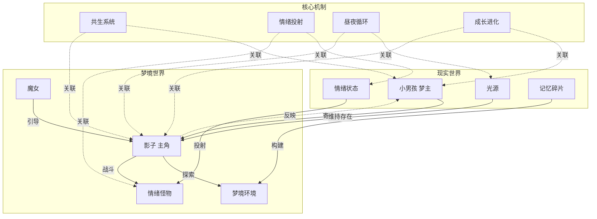

# 《影梦》(Silhouette Dream) 世界观概览

> 简化版本 - 核心概念与系统原理

## 一、核心概念

### 1.1 影子（Shadow）
- **本质**：依靠光存在的共生种族，寄生在人类宿主身上
- **特性**：
  - 光依赖性：需要光源维持自我意识
  - 寄生性：白天依附宿主，夜晚进入梦境
  - 意识性：拥有独立思维和情感
- **存在状态**：
  - 依附态：白天跟随宿主行动
  - 游离态：夜晚在梦境中独立活动
  - 消逝态：黑暗中逐渐失去自我

### 1.2 梦境世界（Dream World）
- **本质**：由梦主潜意识构建的虚拟空间
- **特性**：
  - 主观性：形态受梦主情绪影响
  - 流动性：物理法则不稳定
  - 象征性：事物具有隐喻意义
  - 多层性：可能存在梦中梦结构
- **运作原理**：
  - 情绪投射：情绪具象化为实体
  - 记忆重构：记忆碎片重组为场景
  - 欲望具现：潜意识欲望象征呈现

### 1.3 情绪投射（Emotional Projection）
- **定义**：内在情绪外化为外部实体的机制
- **投射类型**：
  | 情绪 | 投射表现 | 游戏形态 |
  |------|----------|----------|
  | 恐惧 | 威胁性实体 | 怪物、陷阱 |
  | 孤独 | 虚空、缺失 | 空洞、迷宫 |
  | 愤怒 | 破坏性力量 | 狂暴敌人 |
  | 悲伤 | 沉重、缓慢 | 沼泽、锁链 |
  | 焦虑 | 压迫感 | 追逐、倒计时 |

## 二、世界观背景

### 2.1 世界起源
- **远古时期**：永恒太阳照耀，影子一族繁荣发展
- **太阳衰败**：黑夜诞生，影子失去意识，学会寄生求生
- **现代时期**：影子与人类形成共生关系，通过梦境连接

### 2.2 时间规则
- **现实时间**：标准24小时制，线性流动
- **梦境时间**：非线性，可加速、减缓或倒流
- **切换机制**：入睡→进入梦境，醒来→返回现实

### 2.3 核心隐喻
- 整个世界是某个存在的梦境
- 梦境中的存在也是其他存在的梦主
- 层层嵌套，互为表里

## 三、系统原理

### 3.1 共生系统
- **寄生-宿主关系**：
  - 能量流动：宿主 → 影子
  - 信息反馈：影子 → 宿主
  - 情感共鸣：双向影响
- **共生平衡**：
  - 健康共生：双方互惠
  - 失衡状态：一方过度索取
  - 断裂风险：长期分离导致连接减弱

### 3.2 昼夜双模式
| 维度 | 白天模式（现实） | 夜晚模式（梦境） |
|------|------------------|------------------|
| 时间感知 | 线性、稳定 | 非线性、可压缩/延展 |
| 空间结构 | 固定、三维 | 流动、多维 |
| 物理法则 | 牛顿力学 | 奇幻规则 |
| 成长类型 | 永久性 | 临时性 |
| 风险程度 | 低 | 高 |
| 情绪影响 | 积累 | 释放/具象化 |

### 3.3 睡眠阶段系统
- **清醒期（AWAKE）**：梦境入口，记忆碎片收集
- **浅睡期（LIGHT_SLEEP）**：情感挑战，情绪投射
- **深睡期（DEEP_SLEEP）**：深层恐惧，核心冲突
- **REM期（REM）**：剧情高潮，BOSS战斗

## 四、核心关系图

## 五、故事大纲

### 5.1 主线脉络
1. **开端**：影子被魔女唤醒，开始梦境探索
2. **发展**：帮助小熊寻找心脏，理解情感投射
3. **转折**：发现医生真相，面对童年恐惧
4. **高潮**：阻止魔女摧毁太阳，理解她的痛苦
5. **结局**：影子找到存在意义，小男孩学会自我接纳

### 5.2 核心主题
- **自我认同**：影子寻找存在意义
- **情感连接**：建立与接纳各种关系
- **恐惧面对**：转化恐惧为成长动力
- **自我欺骗**：意识到外部寻求的答案就在内心

---

## 文档说明

- **版本**：简化版 v1.0
- **来源**：合并自《概念设定》、《故事设定》、《概念关系图》
- **目的**：提供快速参考，避免细节冗余
- **详细版本**：如需更多细节，请查阅归档文档：
  - `world/archive/concept.md` - 完整概念设定
  - `world/archive/story.md` - 完整故事设定
  - `world/archive/concept-map.md` - 概念关系图